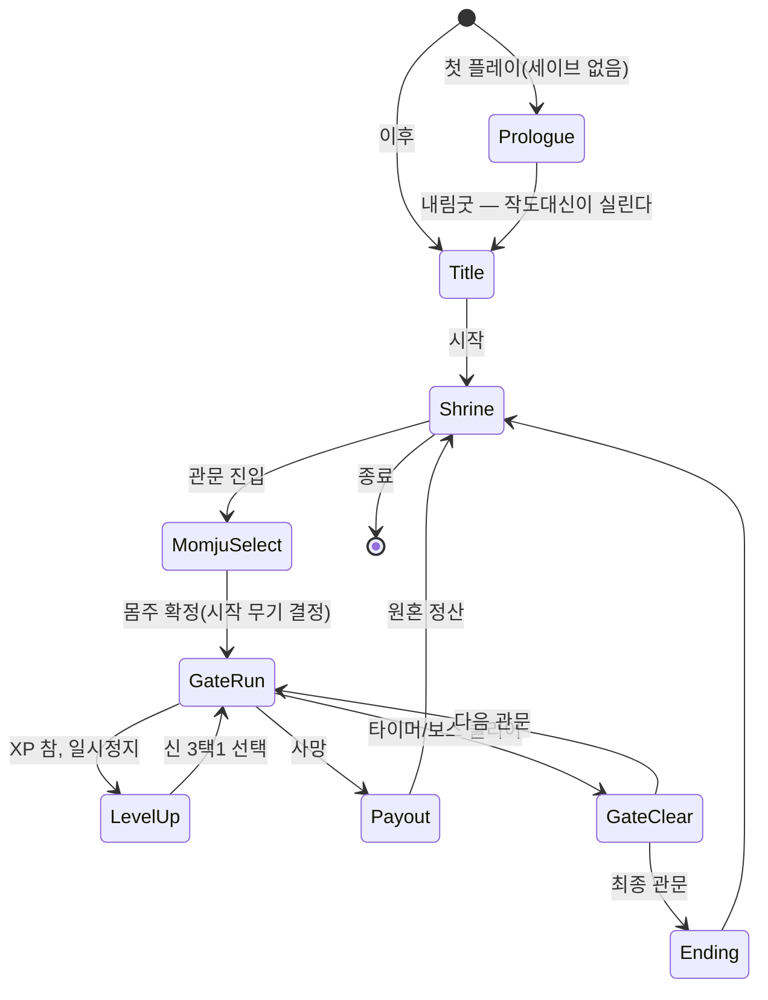
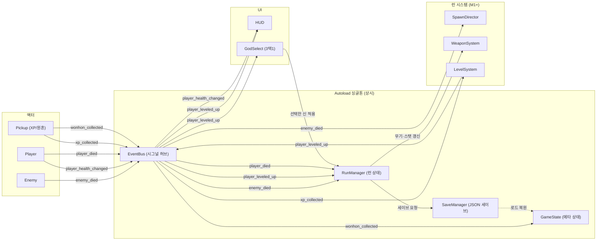
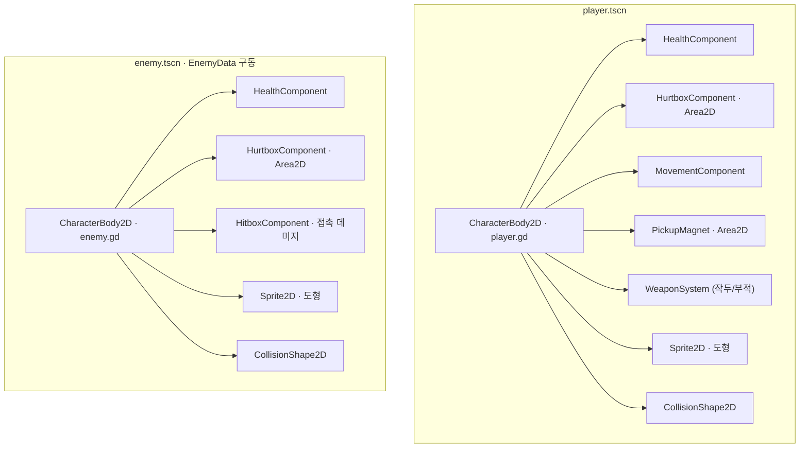
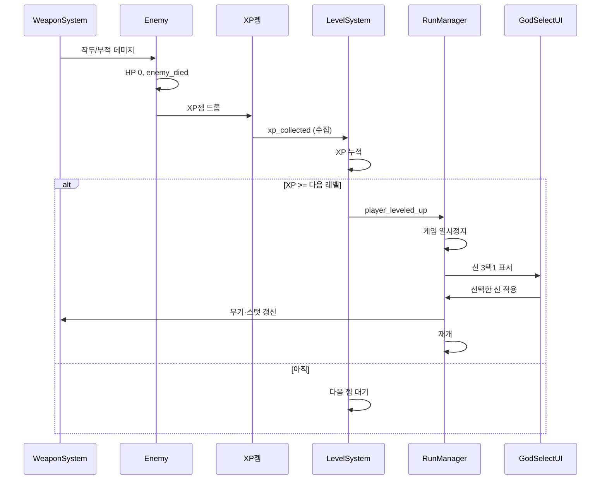

# 저승·바리데기 — 아키텍처 다이어그램

이 문서는 **M1~M4 목표 아키텍처**를 그린 설계도다. 코드가 커져도 구조(디커플링·컴포지션)가
흐트러지지 않게 큰 그림만 잡는다. 세부 수치·스키마는 `design.md`가 정본이다.

현재(M0) 상태: autoload 4종은 스텁으로만 존재하고, 아래 시스템·컴포넌트·UI·액터 씬은 아직 없다.
구현하면서 이 그림을 갱신한다. 과설계를 피하려고 딱 4개만 둔다.

---

## 1. 게임 플로우 상태도
타이틀에서 시작해 신당(허브)과 관문 런을 오가는 최상위 흐름. 씬 전환은 `SceneRouter`(M2+)가,
런 내부 상태(생존/레벨업 일시정지)는 `RunManager`가 소유한다.

- **Prologue** = 첫 플레이 전용. 무병 → 허주풀이 → 내림굿으로 첫 몸주(작도대신)를 받는다.
  몸주는 고르는 것이 아니라 내려온다는 고증을 도입부에 쓰고, 이후부터 선택제로 넘어간다(design.md 3-1-2).
- **MomjuSelect** = 해금된 몸주 중 선택. 몸주가 시작 무기를 정하므로 런의 성격이 여기서 갈린다.

---

## 2. 시스템·이벤트 흐름도
노드끼리 직접 참조하지 않고 **EventBus 시그널**로만 통신한다(디커플링). 화살표 라벨이 시그널 이름이다.
누가 emit 하고 누가 구독하는지가 이 그림의 핵심 계약이다.

---

## 3. 엔티티 컴포지션도
상속이 아니라 **컴포넌트 조합**으로 만든다. `HealthComponent`/`HurtboxComponent`는 플레이어·적·보스가
공유한다. 적은 단일 `enemy.tscn`이 `EnemyData` 리소스를 읽어 스탯·외형을 구성한다(data-driven).

재사용 컴포넌트(`HealthComponent`, `HurtboxComponent`, `HitboxComponent`)는 `scripts/components/`에 두고
player/enemy/boss가 각자 조립한다. 투사체·적·XP 젬은 오브젝트 풀에서 꺼내 쓴다(design.md 15절).

---

## 4. 코어 루프 시퀀스
한 판 안에서 "처치 → XP → 레벨업 → 신 3택1 → 재개"가 런타임에 어떻게 오가는지. 실제 시그널은 모두
EventBus를 거치지만(2번 그림), 여기선 논리 흐름만 단순화해 보인다.

---

## 갱신 규칙
- 시스템·시그널·씬 구조가 바뀌면 이 문서의 해당 다이어그램을 **같은 커밋에서** 갱신한다.
- 수치·스키마는 여기 말고 `design.md`에 쓴다(중복 금지). 이 문서는 "관계·흐름"만 담는다.
